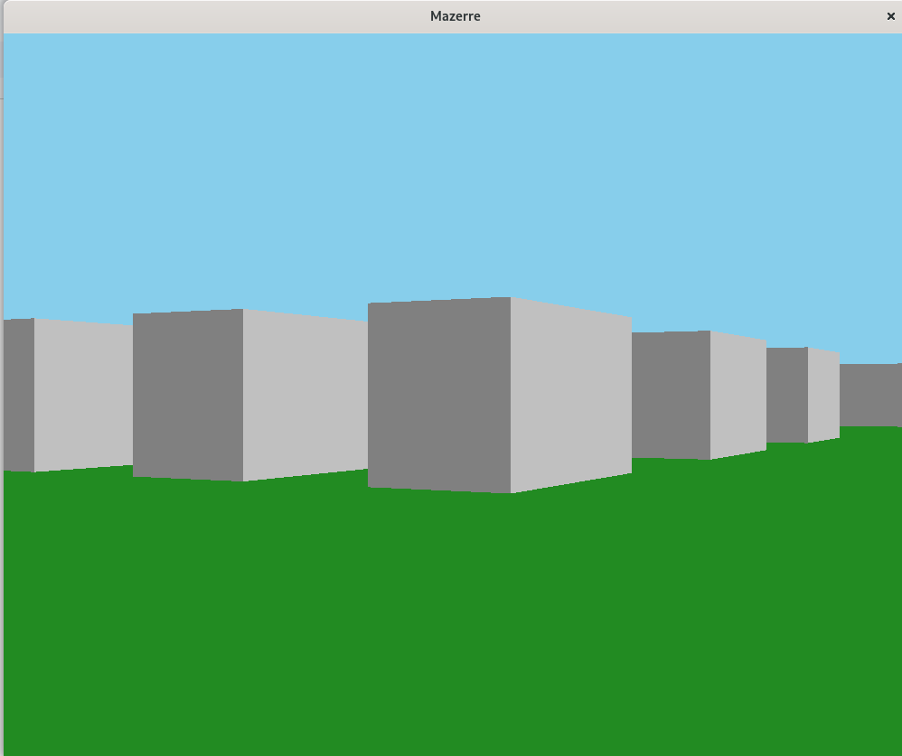
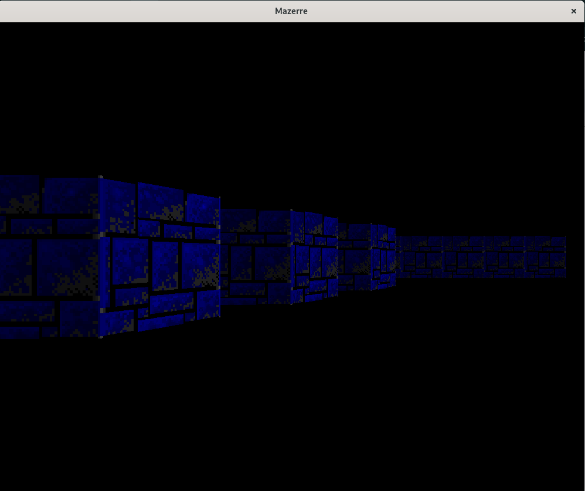

# Mazzerre

This project is a simple maze exploration game that uses SDL2 and SDL2_image libraries for rendering and managing the game window and textures. The game features 3D ray-casting to simulate the player's view of the maze. The player can navigate through the maze and perform basic functions in the maze. Feel free to explore further.

## Introduction

The Maze Project is a small game where the player navigates a 2D maze rendered in a 3D perspective using ray-casting. The game involves loading a predefined maze, rendering the walls and floor, and providing real-time navigation. It uses SDL2 to handle window creation, rendering, and input events. It also includes a function to adjust maze map information from a file and also textures used in rendering.

## Installation

To compile and run the project, you will need to have the following installed on your system:
- GCC (or any Compatible C compiler)
- Make
- SDL2
- SDL2_image
- Compilation and execution has been tested done in Ubuntu 14.04 LTS, Fedora 39.

Please be sure to install dependencies before proceeding.

## Usage

In order to build the project executable. You can run this command on the project root directory.

```bash
make
```

Please any errors can be reported on the github issues tab. The file contains commands that define the flags and compiler that runs the project.
After that, the generated executable can be used to start the game.

```bash
./mazzerre
```

## Screenshots

Below are some screenshots showcasing the Maze Project in action:

### 1. **Exploration of the maze in a colored environment**

*The first person view of navigating the maze in a colored environment.*

### 2. **Exploration of the maze is a textured environment**

*A first-person view of navigating through the maze in a textured environment.*

## Contributing

I welcome any contributions that would help improve and make the game more efficient, If you'd like to contribute please follow these steps.

- Fork the repository.
- Clone your forked repository.
- Create a new branch
- Make your changes.
- Test your changes.
- Commit and push your changes.
- Open a pull request.

Your Pull Request will be reviewed and merged as quick as possible as far as it passes all requirements and tests.
